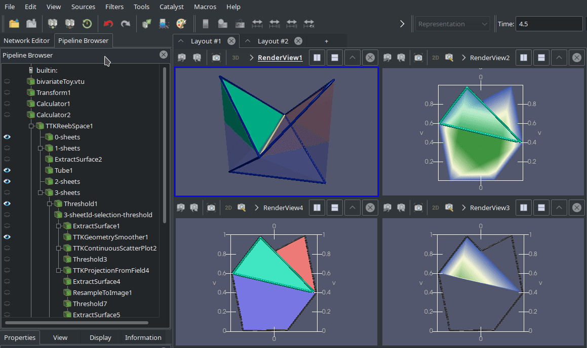

# ParaView Network Editor Plugin


This is an attempt to create a 2D network editor for ParaView, that replaces the built-in tree view pipeline editor.
In its current state, this is a prototype at best, so **use at your own risk**!

This project is in large parts based on inviwo (https://github.com/inviwo/inviwo), which is licensed under the BSD 2-Clause license. See `LICENSE.inviwo` for details.



## Usage

[GitHub Actions ](https://github.com/lhofmann/paraview-network-editor/actions) (Github login required) is set up to automatically build Linux binaries without graphviz (no graph layout feature).

Download [ParaView-5.8.0-MPI-Linux-Python3.7-64bit](https://www.paraview.org/files/v5.8/ParaView-5.8.0-MPI-Linux-Python3.7-64bit.tar.gz) and the [build artifacts](https://github.com/lhofmann/paraview-network-editor/suites/711213037/artifacts/6934209), and extract both in the same location.

### Building from Source

CMake &ge; 3.8, ParaView &ge; 5.8.0, and optionally graphviz are required.

ParaView needs to be build from source, with `BUILD_SHARED_LIBS`, `PARAVIEW_BUILD_QT_GUI` and `PARAVIEW_INSTALL_DEVELOPMENT_FILES` enabled.

Clone and build the plugin
```bash
git clone https://github.com/lhofmann/paraview-network-editor.git
mkdir paraview-network-editor-build
cd paraview-network-editor-build
cmake ../paraview-network-editor -DCMAKE_BUILD_TYPE=Release
cmake --build .
```
Run paraview with
```bash
paraview-network-editor-build/paraview.sh
```
This script runs paraview and automatically loads the plugin.
You can also manually load the file `paraview-network-editor-build/lib/NetworkEditor.so` as plugin.

By default, the network editor plugin swaps places with the render view on load. 
This behavior can be changed in ParaView settings (menu `Edit > Settings... > Network Editor`). 

## Features

* Swaps places with the main render view
* Indicators for visibility of output ports and color legends for active view
* Indicator for modified pipeline items
* Synchronize selection of sources and output ports
* Add/remove connections (drag/drop, press delete to remove selected connections)
* Valid/invalid connections are indicated during drag/drop by color (can be overridden by holding Shift key) 
* Hide/show selected sources and color legends (context menu or double click)
* Copy/paste parts of the pipeline (context menu or Ctrl+C/Ctrl+V)
* Automatic graph layout using optional dependency graphviz
* Use context menu or press Ctrl+Space to place a new source or filter at the last mouse click position
* Node positions are saved/loaded in state files
* All actions can be undone/redone, including moving nodes and graph layout 

## TODO / Known Issues

* There are random crashes (could be related to adding/removing connections)
* Add search, that selects pipeline items by name, type, ...
* Add a dock widget, that contains a filterable list of sources/filters, that can be drag/dropped into the network editor
* Color connections by data type
* Display and edit property links
* Add support for grouping/ungrouping parts of the pipeline (custom filters / vtkSMCompoundSourceProxy)
* Add tooltips, that show information about sources and their output ports
* Custom graph layout algorithm, that takes grid into account (not possible with graphviz)
* Choose better node positions when inserting new sources
* Key shortcuts do not work when the dock widget is detached from the main window

## ParaView Notes

Most of this code was written by examining ParaView's source code. 
Some of the relevant code can be found in these places: 

* output data information: `pqProxyInformationWidget::fillDataInformation`
* set input/output connections: `pqChangeInputDialog` / `pqChangePipelineInputReaction` 
* validate connections: `pqFiltersMenuReaction::updateEnableState`
* get list of filters: `pqProxyGroupMenuManager::lookForNewDefinitions`
* create source: `pqFiltersMenuReaction::createFilter`
* filters menu: `pqParaViewMenuBuilders::buildFiltersMenu`
